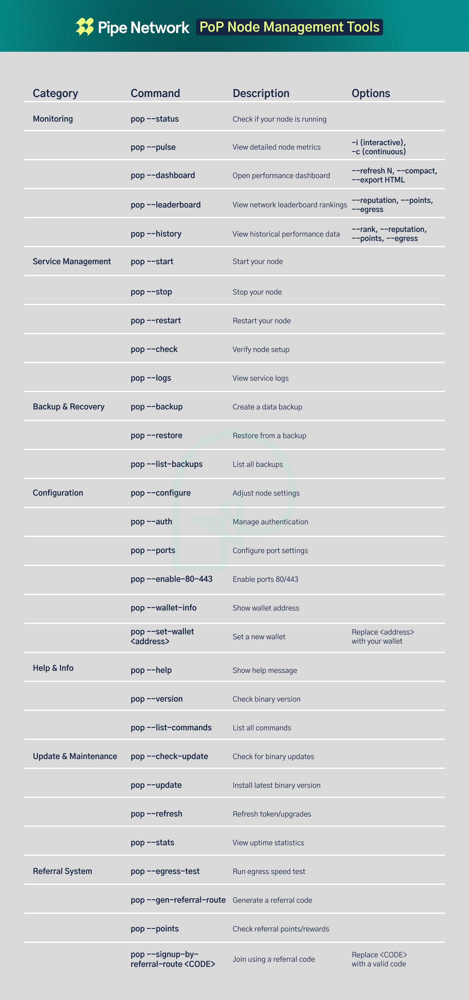

# Start Here: PipeNetwork Node

## Quick Setup (2 minutes)

1. **Open a terminal and run:**
   ```bash
   sudo ./INSTALL
   ```

2. **Enter your Solana wallet address when prompted**
   (Don't have a wallet? [Create one first](docs/guides/wallet-setup.md))

3. **Check that your node is running:**
   ```bash
   pop status
   ```

## Monitoring Your Node



```bash
# See real-time performance
pop monitoring pulse

# Check your earnings
pop points

# Create a referral code for bonuses
pop referral generate
```

## Need Help?

- **Installation problems?** See [Troubleshooting](docs/reference/troubleshooting.md)
- **Want to learn more?** Read the [Quick Start Guide](docs/guides/quick-start.md)
- **Find all commands:** Check the [Command Reference](docs/reference/cli.md)

---

**Your node is earning rewards when it shows as "Running" in the status!** 