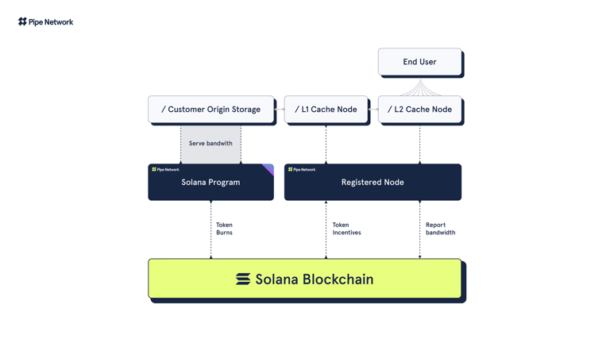
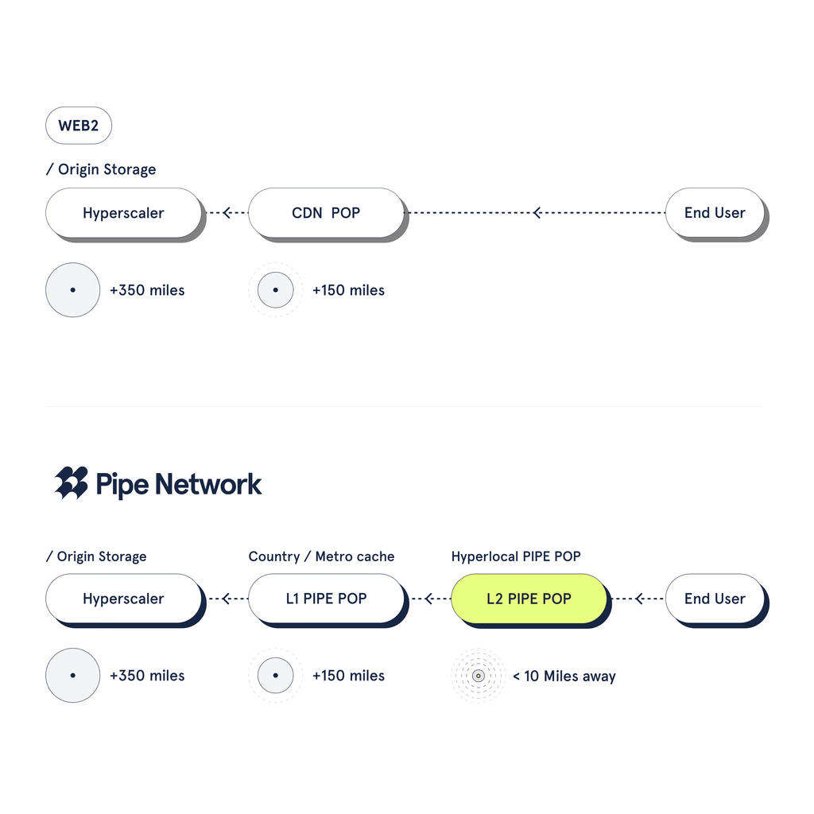

# Pipe Network: Decentralized Content Delivery Network
## Technical Documentation and API Reference

## Table of Contents
- [Welcome](#welcome)
- [Introduction](#introduction)
- [Architecture](#architecture)
- [Key Features](#key-features)
- [Scalability and Network Growth](#scalability-and-network-growth)
- [Opportunities and Use Cases](#opportunities-and-use-cases)
- [Operating a DevNet CDN PoP Node](#operating-a-devnet-cdn-pop-node)
- [CDN API Reference](#cdn-api-reference)

## Welcome

Welcome to Pipe Network: Building a permissionless future, one node at a time.

Pipe Network is a hyper-localized, scalable content delivery network (CDN) built on Solana's high-performance blockchain. Each CDN PoP node in the network is strategically placed close to users for fast, reliable content delivery. Pipe Network's nodes ensure low-latency content streaming, making it ideal for media and real-time applications. Anyone can run a node, contributing to the network's growth and resilience.

## Introduction

Pipe Network is a decentralized, permissionless content delivery network (CDN) designed to address the limitations of traditional, centralized CDNs. By utilizing a unique architecture built on the Solana blockchain, Pipe Network offers a scalable, cost-efficient, and highly secure solution for delivering content globally.

At the core of Pipe Network's innovation is the deployment of hyperlocal Pipe PoP (Points of Presence) nodes. These nodes are strategically distributed in underserved areas to optimize latency, ensuring that content is delivered faster and more efficiently than centralized CDNs, particularly in regions where traditional CDNs fall short. This hyperlocal focus enhances the user experience by dramatically reducing the distance data must travel, which is key to achieving real-time content delivery.

Through the use of Pipe Credits and Data Credits, Pipe Network offers flexible, transparent payment structures that align incentives between users and node operators. The network compensates node operators based on local resource scarcity, ensuring fair and efficient service delivery.

Robust security and network management features, including real-time data transfer, DDoS protection, dynamic IP/geographical blocking, DMCA complaint handling, and access to rolling logs, further distinguish Pipe Network from legacy solutions. With decentralized infrastructure and advanced blockchain technology, Pipe Network reduces operational costs.

Pipe Network is set to transform content delivery with a globally distributed, decentralized architecture that focuses on real-time performance, transparency, and scalability through hyperlocal PoP nodes.

The internet is increasingly reliant on fast, efficient content delivery to power modern applications, websites, and services. Traditional Content Delivery Networks (CDNs) have played a critical role in distributing content to users around the globe. However, as demand for real-time access to data and media grows, centralized CDNs face limitations, such as high costs, latency in underserved regions, and bottlenecks due to their centralized nature.

### Current Limitations of Centralized CDNs

Centralized CDNs often require significant capital investment in infrastructure and are primarily concentrated in urban or high-traffic areas, leading to slower speeds in remote or underserved locations. Moreover, these CDNs operate within proprietary systems, creating barriers for smaller businesses and independent developers to access affordable content delivery solutions.

With growing demands for decentralization, security, and improved data delivery performance, the need for a new paradigm has emerged.

### The Demand for Decentralized, Permissionless CDNs

Decentralization offers the ability to spread content delivery responsibilities across a global network of independent nodes. Permissionless networks enable anyone with the necessary hardware to contribute to the network, eliminating central points of control and promoting true global distribution.

Pipe Network addresses these challenges with its decentralized CDN model. By leveraging blockchain technology, a unique economy, and a distributed network of hyperlocal Pipe PoP nodes, Pipe Network is designed to optimize latency, ensure equitable access to content, and reduce operational costs.

### Introducing Pipe Network

Pipe Network is a revolutionary decentralized CDN that uses the Solana blockchain to create a permissionless ecosystem. It allows anyone to operate nodes, leading to an expanded network of PoP nodes in hyperlocal regions worldwide. This model not only reduces latency but also provides a solution to the centralized inefficiencies of traditional CDNs.

Pipe Network aligns the incentives of users and node operators through Pipe Credits and Data Credits. This decentralized system prioritizes both cost-effectiveness and performance, enabling users to enjoy content delivery at a fraction of the cost compared to traditional solutions.

Pipe Network's unique combination of decentralization, hyperlocal PoP nodes, and blockchain-backed security is poised to redefine how content is distributed across the internet, especially in regions traditionally underserved by existing CDNs.

## Architecture

Pipe Network's decentralized architecture is designed to meet the evolving demands of content delivery in a more efficient and scalable way than traditional, centralized CDNs. The network leverages a combination of decentralized nodes, blockchain technology, and hyperlocal Points of Presence (PoP) to deliver content quickly and securely across the globe.

### Node Structure and Hyperlocal PoP Strategy

At the heart of Pipe Network's architecture are its hyperlocal PoP nodes, strategically deployed to ensure that content is delivered with minimal latency. Unlike traditional CDNs that rely on large, centralized server farms in major cities, Pipe Network operates on a decentralized model, where independent operators can deploy nodes in their local regions. This localized approach ensures content delivery is optimized for proximity, dramatically reducing latency for users, especially in underserved or remote areas.

Nodes are permissionless, meaning anyone with the appropriate hardware can contribute to the network. This creates a truly decentralized system where content delivery is not restricted by the centralization of infrastructure. Each node in the network can cache and deliver content to nearby users, providing both redundancy and improved performance.

### Content Distribution and Caching Mechanism

Pipe Network employs a distributed caching mechanism, where content is cached at the hyperlocal PoP nodes. The Cache Management System (CMS) manages the coordination of content, while individual nodes handle the local caching. In future development phases, Pipe Network will enable peer-to-peer connections between nodes, allowing them to sync and share cached content, further improving content availability and reducing the burden on the CMS.

This decentralized caching strategy ensures that content is not only served faster to local users but also reduces the need for redundant long-distance data transfers, leading to more efficient bandwidth usage.

### Solana Blockchain Integration

Pipe Network is built on the Solana blockchain, chosen for its high throughput, low transaction costs, and speed. The Solana integration enables the decentralized control of the network through smart contracts, ensuring that all transactions—whether it's payments for data bandwidth, or network upgrades—are handled securely and efficiently.

Solana's architecture allows Pipe Network to scale without compromising performance. The use of blockchain also brings transparency to the system, as all transactions are recorded immutably on-chain. This provides users and node operators with confidence in the fairness and integrity of the system.



## Key Features

Pipe Network's decentralized CDN model is designed to address the specific needs of modern content delivery. By combining innovative technology with a robust feature set, Pipe Network offers a unique solution for businesses, developers, and users seeking to optimize content distribution.

### 1. Hyperlocal Pipe PoP Nodes

Pipe Network's hyperlocal Points of Presence (PoP) nodes are a fundamental aspect of the network's performance and efficiency. These PoP nodes are deployed in localized areas, enabling content to be delivered from the closest possible node to the end-user, significantly reducing latency. Unlike traditional CDNs that concentrate nodes in major cities, Pipe Network's decentralized model allows nodes to be set up in any region, including underserved and remote areas. This helps achieve true real-time data delivery across the globe.

### 2. Cost Efficiency

One of Pipe Network's core goals is to provide a cost-effective alternative to centralized CDNs. With its decentralized infrastructure and a blockchain-based system, Pipe Network can deliver content at a significantly lower price. The burn-mint equilibrium system ensures that users only pay for what they use, with Data Credits being consumed as data is transferred.

### 3. Real-time Data Delivery

Pipe Network outperforms competitors in real-time content delivery by leveraging its decentralized, hyperlocal PoP nodes. The proximity of these nodes to users minimizes latency, ensuring that data is delivered faster than traditional CDNs. This is particularly important for applications requiring real-time responsiveness, such as live video streaming, gaming, and real-time communications.

### 4. Security and Data Integrity

Pipe Network incorporates several advanced security features to ensure data integrity and protect against malicious attacks:

**DDoS Protection**: The network provides built-in Distributed Denial of Service (DDoS) protection for endpoints, mitigating the risk of attacks that could overwhelm content delivery.

**DMCA Complaint System**: Pipe Network has a backend system that allows customers to file and manage Digital Millennium Copyright Act (DMCA) complaints. The system parses URLs and connects them to the relevant customer, ensuring that content takedown requests are handled efficiently and securely.

**IP and Geo-blocking**: Customers can block access to content based on IP addresses or geographical locations. This feature offers flexibility in managing where content can be accessed and by whom.

### 5. Rolling Egress Logs

Pipe Network provides access to a window of egress URL logs for each customer's configured endpoints. This feature gives customers insights into how their content is being accessed, enabling them to monitor traffic patterns and optimize their delivery strategies.

### 6. Cache Invalidation

Customers have the ability to invalidate cached content at the PoP nodes. This ensures that outdated or incorrect data is removed from the cache, allowing the most up-to-date content to be served to users. Cache invalidation is crucial for dynamic content that changes frequently.

### 7. Header Filtering and URL Query Blocks

Pipe Network allows customers to filter requests to their content endpoints by analyzing headers or URL queries. This feature provides an extra layer of control, ensuring that only valid, authorized requests are allowed through.

### 8. Local Scarcity-Based Node Incentives

Pipe Network ties node operator payouts to local resource scarcity. This model ensures that operators in regions with fewer nodes or higher data demand are compensated more generously, incentivizing the deployment of nodes where they are needed the most. This approach promotes a balanced and distributed network that can grow organically based on demand.

## Scalability and Network Growth

Pipe Network is designed to scale seamlessly as demand for content delivery increases. The network's decentralized, permissionless architecture, combined with the hyperlocal PoP node strategy, ensures that it can grow organically while maintaining performance, security, and cost-efficiency.

### Decentralized Scalability

Unlike centralized CDNs, where capacity is constrained by infrastructure investments, Pipe Network's decentralized model allows anyone to contribute to the network by operating a node. This permissionless approach encourages rapid expansion, as node operators are incentivized through the scarcity-based reward system, creating a natural distribution of nodes in underserved areas where demand is high.

As more nodes join the network, content delivery speeds improve, especially in regions where traditional CDNs struggle to provide fast, reliable service. The hyperlocal focus of Pipe PoP nodes also ensures that the network can grow without requiring large, centralized data centers, making it inherently more flexible and scalable.

### Network Expansion Strategy

Pipe Network's growth strategy is centered around encouraging node operators to deploy in regions with high demand but low coverage. The system's rewards model, based on local resource scarcity, ensures that nodes are set up in underserved areas where they can provide the most value.

Additionally, Pipe Network has implemented a phased development approach:

**Phase 1**: The current design involves nodes that are connected to a cache management system, which manages content distribution. This phase ensures that content is cached locally at the PoP nodes, reducing the load on the CMS and improving delivery speeds.

**Phase 2**: In future phases, Pipe Network will enable peer-to-peer connections between nodes. This will allow nodes to synchronize and share cached content directly, reducing reliance on the CMS and improving the overall efficiency of the network.

**Phase 3**: In the long term, Pipe Network will focus on advanced features such as synchronized caching across nodes, real-time analytics, and geographic expansion to further enhance performance and reliability.

### Hyperlocal PoP Nodes and Global Reach

Hyperlocal PoP nodes are critical to Pipe Network's scalability. By placing these nodes in closer proximity to end-users, Pipe Network ensures that data does not have to travel long distances, reducing latency and improving the speed of content delivery. As more nodes are added, especially in regions that are typically underserved, Pipe Network can deliver content faster and more efficiently than traditional CDNs.

The scalability of hyperlocal PoP nodes also means that Pipe Network can respond dynamically to changes in demand. As new regions experience growth in digital content consumption, node operators can deploy additional nodes to meet that demand, ensuring that the network remains responsive and efficient.

## Opportunities and Use Cases

### Opportunities in the CDN Space

As demand for high-speed, low-latency streaming continues to grow, traditional CDNs are struggling to keep up. Pipe Network offers a fresh solution, leveraging Solana's decentralized architecture to deliver content reliably and at lower costs.

Key benefits include:

**Ultra-low Latency**: Fast, decentralized content delivery ensures smoother user experiences.

**Scalability**: Effortlessly adapts to growing content demands without major infrastructure investment.

**Enhanced Security**: Hyper-localized distributed design protects against cyberattacks and system failures.

**Cost efficiency**: Provides a more affordable content delivery solution for providers of all sizes.

Pipe Network is the next evolution in content delivery, shaping the future of the internet. Join us in building today!

### Pipe Network CDN Advantages

Pipe Network uses hyper-local cache (L2 Pipe PoP) that brings content closer to the end user than traditional CDNs, resulting in reduced latency, faster delivery times, and enhanced streaming quality.

For example, if content originates from a hyperscaler located 350 miles away, it will then pass through two layers of caching:

**L1 Pipe PoP (Country/Metro Cache)**: A cache located 150 miles from the user. 

**L2 Pipe PoP (Hyperlocal Cache)**: A second, much closer cache located within 10 miles of the end user, ensuring ultra-low latency and significantly faster content delivery. 



Ultimately, achieving reduce travel distance, enhanced speed, and optimal efficiency compared to traditional CDN setups.

## Operating a DevNet CDN PoP Node

The binary of the CDN PoP node For DevNet2 is publicly available.

Fill out this form to be notified of new releases and to be entered for a chance to win on-chain prizes:
https://docs.google.com/forms/d/e/1FAIpQLScbxN1qlstpbyU55K5I1UPufzfwshcv7uRJG6aLZQDk52ma0w/viewform

💡 Prepare for Testnet: Run a DevNet2 node, and keeping it running 24/7 will increase your node score, this will directly translate into a high node score for Testnet. The higher the node score the more traffic the protocol will direct to the node and increase the rewards. 

### Key Features

**Location-Based Rewards**: Operators in underrepresented or high-demand regions earn additional incentives.

**PoP Node Rewards**: Rewards are based on metrics such as data served, latency, and uptime. Consistent uptime and performance standards yield higher rewards, while downtime and churn result in rejoin penalties to deter disruption.

## CDN API Reference

This section provides a comprehensive overview of the Pipe CDN API. All endpoints are currently based on the Pipe Network CDN Devnet deployment on Solana Devnet.

### Base URL
All API endpoints are relative to the base URL.

### Authentication
Most endpoints require authentication using two parameters:

- `user_id`: The unique identifier for the user
- `user_app_key`: The application key for the user

These parameters are typically included as query parameters for GET requests or in the request body for POST requests.

### Account Management APIs

#### Create User
Creates a new user account.

```http
POST /createUser
Content-Type: application/json

Request Body:
{
  "username": "string"
}

Response:
{
  "user_id": "string",
  "user_app_key": "string",
  "solana_pubkey": "string"
}
```

#### Rotate App Key
Rotates (changes) the application key for a user.

```http
POST /rotateAppKey
Content-Type: application/json

Request Body:
{
  "user_id": "string",
  "user_app_key": "string"
}

Response:
{
  "user_id": "string",
  "new_user_app_key": "string"
}
```

### File Management APIs

#### Upload File
Uploads a file to Pipe CDN.

```http
POST /upload
Content-Type: multipart/form-data

Query Parameters:
- user_id: User ID
- user_app_key: User application key
- file_name: Name to store the file as
- epochs (optional): Storage duration in epochs

Body: File content as multipart/form-data
Response: The uploaded filename as a string
```

#### Priority Upload
Uploads a file with higher priority.

```http
POST /priorityUpload
Content-Type: multipart/form-data

Query Parameters:
- user_id: User ID
- user_app_key: User application key
- file_name: Name to store the file as
- epochs (optional): Storage duration in epochs

Body: File content as multipart/form-data
Response: The uploaded filename as a string
```

#### Download File
Downloads a file from Pipe CDN.

```http
GET /download

Query Parameters:
- user_id: User ID
- user_app_key: User application key
- file_name: Name of the file to download

Response: File content with appropriate Content-Type and Content-Length headers
```

#### Priority Download
Downloads a file with higher priority.

```http
GET /priorityDownload

Query Parameters:
- user_id: User ID
- user_app_key: User application key
- file_name: Name of the file to download

Response: File content as Base64-encoded string
```

#### Delete File
Deletes a file from storage.

```http
POST /deleteFile
Content-Type: application/json

Request Body:
{
  "user_id": "string",
  "user_app_key": "string",
  "file_name": "string"
}

Response:
{
  "message": "string"
}
```

#### Create Public Link
Creates a public link for a file.

```http
POST /createPublicLink
Content-Type: application/json

Request Body:
{
  "user_id": "string",
  "user_app_key": "string",
  "file_name": "string"
}

Response:
{
  "link_hash": "string"
}
```

#### Public Download
Downloads a file using a public link.

```http
GET /publicDownload

Query Parameters:
- hash: The public link hash

Response: File content with appropriate headers
```

#### Extend Storage
Extends the storage duration for a file.

```http
POST /extendStorage
Content-Type: application/json

Request Body:
{
  "user_id": "string",
  "user_app_key": "string",
  "file_name": "string",
  "additional_months": number
}

Response:
{
  "message": "string",
  "new_expires_at": "string"
}
```

### Wallet and Payments APIs

#### Check SOL Balance
```http
POST /checkWallet
Content-Type: application/json

Request Body:
{
  "user_id": "string",
  "user_app_key": "string"
}

Response:
{
  "user_id": "string",
  "public_key": "string",
  "balance_lamports": number,
  "balance_sol": number
}
```

#### Check PIPE Token Balance
```http
POST /getCustomTokenBalance
Content-Type: application/json

Request Body:
{
  "user_id": "string",
  "user_app_key": "string"
}

Response:
{
  "user_id": "string",
  "public_key": "string",
  "token_mint": "string",
  "amount": "string",
  "ui_amount": number
}
```

#### Check DC Balance
```http
POST /getDcBalance
Content-Type: application/json

Request Body:
{
  "user_id": "string",
  "user_app_key": "string"
}

Response:
{
  "user_id": "string",
  "dc_balance": number
}
```

#### Swap SOL for PIPE
```http
POST /swapSolForPipe
Content-Type: application/json

Request Body:
{
  "user_id": "string",
  "user_app_key": "string",
  "amount_sol": number
}

Response:
{
  "user_id": "string",
  "sol_spent": number,
  "tokens_minted": number
}
```

#### Swap PIPE for DC
```http
POST /swapPipeForDc
Content-Type: application/json

Request Body:
{
  "user_id": "string",
  "user_app_key": "string",
  "amount_pipe": number
}

Response:
{
  "user_id": "string",
  "pipe_spent": number,
  "dc_minted": number
}
```

#### Withdraw SOL
```http
POST /withdrawSol
Content-Type: application/json

Request Body:
{
  "user_id": "string",
  "user_app_key": "string",
  "to_pubkey": "string",
  "amount_sol": number
}

Response:
{
  "user_id": "string",
  "to_pubkey": "string",
  "amount_sol": number,
  "signature": "string"
}
```

#### Withdraw Custom Token
```http
POST /withdrawToken
Content-Type: application/json

Request Body:
{
  "user_id": "string",
  "user_app_key": "string",
  "to_pubkey": "string",
  "amount": number
}

Response:
{
  "user_id": "string",
  "to_pubkey": "string",
  "amount": number,
  "signature": "string"
}
```

### Utility APIs

#### Get Priority Fee
```http
GET /getPriorityFee

Response:
{
  "priority_fee_per_gb": number
}
```

#### Check Version
```http
POST /versionCheck
Content-Type: application/json

Request Body:
{
  "current_version": "string"
}

Response:
{
  "is_latest": boolean,
  "download_link": "string" (optional),
  "latest_version": "string" (optional),
  "release_notes": "string" (optional),
  "minimum_required": "string" (optional)
}
```

### Implementation Notes

#### Error Handling
All API calls should handle HTTP status codes appropriately:

- 200 OK: Successful request
- 400 Bad Request: Invalid request parameters
- 401 Unauthorized: Authentication failed
- 404 Not Found: Resource not found
- 500 Internal Server Error: Server-side error

Error responses typically include a text message explaining the error.

#### File Encryption
The Pipe CLI implements client-side encryption, which is not part of the API. If you want to implement encryption in your application:

- Use a strong encryption algorithm (AES-256-GCM is recommended)
- Generate and store a random salt and nonce for each encrypted file
- Derive an encryption key from the user's password using a strong KDF like Argon2
- Encrypt the file before uploading and decrypt after downloading
- Store encryption parameters (salt, nonce) securely, but never store the password

#### Best Practices
1. **Retries and Backoff**
   - Initial delay: 1000ms
   - Max delay: 10000ms
   - Limit retries: 3

2. **Upload Considerations**
   - Use chunked uploads or streaming for large files
   - Implement progress tracking
   - Limit concurrent requests to avoid overwhelming the server

## Future Development

### Testnet
Coming Soon!

### Mainnet
Coming 2025!

## Support and Resources

- [Dashboard](https://dashboard.pipenetwork.com/node-lookup)
- [DevNet Signup Form](https://docs.google.com/forms/d/e/1FAIpQLScbxN1qlstpbyU55K5I1UPufzfwshcv7uRJG6aLZQDk52ma0w/viewform)
- [GitHub Repository](https://github.com/preterag/surrealine-backend.git)

---

*Last updated: 2025* 