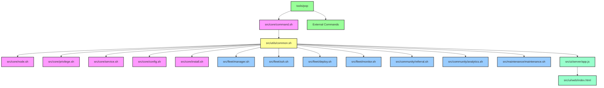

# Pipe Network PoP Node Management Tools Architecture

This document outlines the architecture of the Pipe Network PoP Node Management Tools, explaining the structure, components, and interactions between different modules.

## System Architecture Overview

The Pipe Network PoP Node Management Tools is organized as a modular system with clearly defined component responsibilities. The architecture follows a layered approach, with core utilities serving as a foundation for more specialized modules.



## Component Roles and Responsibilities

### Core Components

1. **tools/pop**
   - Main entry point script for the command-line interface
   - Routes commands to appropriate modules
   - Handles global options and standardizes command formats

2. **src/core/command.sh**
   - Provides fundamental utilities:
     - Color definitions for terminal output
     - Basic logging functions (info, warning, error, debug)
     - Command parsing and routing
   - Does not depend on other modules

3. **src/utils/common.sh**
   - Imports and builds upon command.sh
   - Provides extended utility functions:
     - File and directory operations
     - User interaction helpers
     - Formatting utilities
     - JSON processing
     - Safety checks
   - Serves as a bridge between core and functional modules

### Functional Modules

#### Core Functionality

- **src/core/node.sh**: Node lifecycle management (start, stop, restart)
- **src/core/privilege.sh**: Privilege elevation and permission management
- **src/core/service.sh**: Service management and monitoring
- **src/core/config.sh**: Configuration handling and validation
- **src/core/install.sh**: Installation and uninstallation procedures

#### Fleet Management

- **src/fleet/manager.sh**: Node registration and management
- **src/fleet/ssh.sh**: Remote command execution
- **src/fleet/deploy.sh**: File deployment to remote nodes
- **src/fleet/monitor.sh**: Metrics collection and monitoring

#### Community Features

- **src/community/referral.sh**: Referral program management
- **src/community/analytics.sh**: Network statistics and leaderboards

#### Maintenance

- **src/maintenance/maintenance.sh**: Backup, restore, and cleanup

#### Web UI

- **src/ui/server/app.js**: Lightweight HTTP server for the Web UI
- **src/ui/web/index.html**: Main Web UI application and components
- **src/installer/web_installer.sh**: Auto-launch and installation wizard functionality

## Import Hierarchy and Dependency Management

The system follows a clear import hierarchy to prevent circular dependencies:

1. **Base Layer**: command.sh (no dependencies)
2. **Utility Layer**: common.sh (imports command.sh)
3. **Functional Modules**: All other modules (import common.sh)

This structure ensures that:
- Lower layers don't depend on higher layers
- Functionality is well-organized and reusable
- Core utilities are consistent across all modules

## Data Flow

Commands flow through the system as follows:

1. User enters a command via the CLI (tools/pop) or Web UI
2. Command is standardized and parsed by command.sh or transformed by the UI server
3. Command is routed to the appropriate module
4. Module executes the command, using utilities from common.sh as needed
5. Results are displayed to the user through consistent output formatting or returned to the Web UI

## File Structure

```
pipe-pop/
├── tools/
│   └── pop                      # Main CLI entry point
├── src/
│   ├── core/                    # Core functionality
│   │   ├── command.sh           # Command parsing and basic utilities
│   │   ├── node.sh              # Node management
│   │   ├── privilege.sh         # Privilege handling
│   │   ├── service.sh           # Service management
│   │   ├── config.sh            # Configuration handling
│   │   └── install.sh           # Installation procedures
│   ├── utils/                   # Utility modules
│   │   ├── common.sh            # Common utilities and helpers
│   │   ├── security/            # Security-related utilities
│   │   └── backup/              # Backup utilities
│   ├── fleet/                   # Fleet management
│   │   ├── manager.sh           # Node registration and management
│   │   ├── ssh.sh               # Remote command execution
│   │   ├── deploy.sh            # File deployment
│   │   └── monitor.sh           # Metrics collection
│   ├── community/               # Community features
│   │   ├── referral.sh          # Referral system
│   │   └── analytics.sh         # Network analytics
│   ├── maintenance/             # Maintenance tools
│   │   └── maintenance.sh       # Backup, restore, cleanup
│   ├── ui/                      # Web UI components
│   │   ├── server/              # Server-side components
│   │   │   ├── app.js           # Main server application
│   │   │   ├── routes/          # API routes
│   │   │   └── services/        # Backend services
│   │   └── web/                 # Frontend components
│   │       ├── index.html       # Main application page
│   │       ├── css/             # Stylesheets
│   │       ├── js/              # Client-side scripts
│   │       └── assets/          # Images and other assets
│   └── installer/               # Installation components
│       └── web_installer.sh     # Auto-launch functionality
├── config/                      # Configuration files
├── data/                        # Data storage
└── docs/                        # Documentation
    └── development/
        └── architecture.md      # This file
```

## Best Practices for Module Development

When developing new modules or making changes to existing ones:

1. **Respect the Import Hierarchy**
   - Modules should import common.sh, not command.sh directly
   - Higher-level modules should not be imported by lower-level modules

2. **Use Utility Functions**
   - Leverage the utility functions in common.sh when possible
   - Avoid duplicating functionality that exists in utility modules

3. **Consistent Error Handling**
   - Use the logging functions (log_info, log_error, etc.) consistently
   - Return appropriate exit codes for error conditions

4. **Modularity**
   - Keep modules focused on specific functionality
   - Break large files into smaller, more manageable components

5. **Documentation**
   - Include clear comments in code
   - Update documentation when making architectural changes
