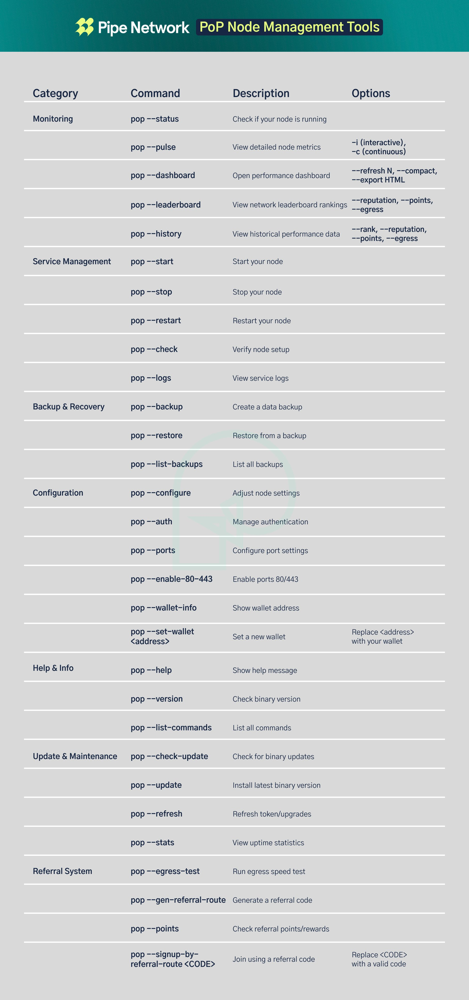

# Quick Start Guide

Get your Pipe Network node running in minutes.

## 1. One-Command Installation

```bash
sudo ./INSTALL
```

When prompted, enter your Solana wallet address. The installer will:
- Install all dependencies
- Configure your firewall
- Set up the service
- Add the global `pop` command

## 2. Verify Installation

Check that your node is running:

```bash
pop status
```

You should see:
- Node status (running/not running)
- Reputation score
- Points earned
- Network statistics

## 3. Real-Time Monitoring



Start the monitoring dashboard:

```bash
pop monitoring pulse
```

This shows:
- Live status updates every 5 seconds
- Detailed reputation metrics
- Resource usage (CPU, memory)
- Network port status

## 4. Check the Logs

View the system logs:

```bash
pop monitoring logs
```

## 5. Verify Your Wallet

Confirm your wallet is correctly configured:

```bash
pop wallet info
```

## 6. Generate Referral Code

Create a referral code to earn extra rewards:

```bash
pop referral generate
```

## Common Commands

| Command | Description |
|---------|-------------|
| `pop status` | Check node status |
| `pop monitoring pulse` | Real-time monitoring |
| `pop points` | View earnings |
| `pop restart` | Restart the node |
| `pop security check` | Verify security |

## Next Steps

- Read the [CLI Reference](../reference/cli.md) for all available commands
- Check [Earning with Pipe Network](earning.md) to maximize your rewards
- Learn about [Security Best Practices](security.md) to protect your node
- See [Troubleshooting](../reference/troubleshooting.md) if you encounter issues 